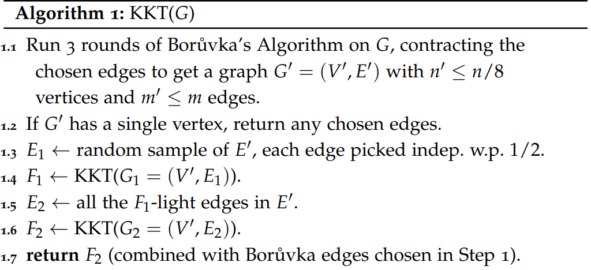

A randomized algorithm for finding the Minimum Spanning Tree in $O(m + n)$ expected time. Created by *Karger, Klein, Tarjan*.

## Definitions & Properties
1. **Forest -** An undirected graph in which any two vertices are connected by at most one path. Can also be defined as an undirected graph with no cycles, or a graph with multiple trees as the components.
2. **Cut Rule -** For any cut of the graph, the minimum-weight edge that crosses the cut must be in the MST. This rule helps us determine what to add to our MST.
3. **Cycle Rule -** For any cycle in G, the heaviest edge on that cycle cannot be in the MST. This helps us determine what we can remove in constructing the MST.
4. **F-heavy** - Let $F$ be a forest that is a subgraph of $G$. An edge $e \in E(G)$ is said to be *F-heavy* if $e$ creates a cycle when added to $F$, and is the heaviest edge in this cycle.
5. **F-light** - An edge which is not *F-heavy* is *F-light*.
### Heavy & Light edges Properties
1. Edge $e$ is F-light $\iff e \in \operatorname{MST}(F \cup \{e\})$. This essentially means that we can include $e$ when making the MST.
2. If $T$ is an MST of $G$, then edge $e \in E(G)$ is *T-light* if and only if $e \in T$.
3. For any forest $F$, the *F-light* edges contain the MST of the underlying graph $G$. In other words, an *F-heavy* edge is also heavy with respect to the MST of the entire graph.

The last point implies that if we find the *F-heavy* edges for some forest $F$ that is a subgraph of $G$, they will be heavy with respect to the minimum spanning tree of $G$ as well, hence we can discard them.

Hence, we can use a strategy of creating a random forest $F$, finding and discarding all the F-heavy edges, and keep repeating till you have $n - 1$ edges left.

To use this strategy, we need 2 things
1. **MST Verification -** Given $F$, how can we quickly classify an edge as heavy or light?
2. **Randomization -** How do we ensure we find a forest with many F-heavy edges, ensuring that we discard many edges?

We'll assume for now that we can output the set of all F-light edges of a forest $F$ in time $O(m + n)$.
## Algorithm

### Correctness
**Claim -**  $\operatorname{KKT}$ returns $\operatorname{MST}(G)$

We've already stated that removing the heavy edges of any forest $F$ in a graph $G$ doesn't change the MST.  Therefore, the MST of $G'$ will be the same as the MST of $G_{2}$.

We can then add the contracted edges of Boruvka's algorithm and get the MST by the cut rule.

### Claims
#### 1. $\mathbb{E}[\#E_{1}] = \frac{m'}{2}$
At step $\texttt{1.3}$, we are randomly sampling $E'$, which is of size $m'$. Since we are picking each edge with probability, by linearity of expectation, the expected number of edges in $E_{1}$ is $\frac{m'}{2}$
#### 2. $\mathbb{E}[\#E_{2}] \leq 2n'$
To prove this, we look at the construction of $F_{1}$ in the perspective of Kruskal's algorithm, making it more intuitive to analyze.

We sort all the edges in $E'$, and run a slightly modified Kruskal's, iterating over edges $e_{1}, e_{2}, \dots, e_{|E'|}$, creating $F_{1}$.

**Useful -** An edge $e$ is said to be useful in the current state if it connects two trees / doesn't form a cycle.

Now, when we are iterating over $e_{i}$, we first determine if the edge is *useful* or not. If it is useful, we then flip an unbiased coin, and include the edge $e_{i}$ in $F_{1}$ if we get heads, else we skip it.\
We note that this algorithm is equivalent to step $\texttt{1.3, 1.4}$ in the $\operatorname{KKT}$ algorithm, hence we can analyze those steps indirectly by analyzing this modified Kruskal's.

**Number of heads required -** Given there are $n'$ nodes, the maximum number of edges we can include is $n' - 1$, hence the maximum number of heads we can get is $n' - 1$  as well.

**Expected number of coin flips -** The probability of including a useful edge is $\frac{1}{2}$, hence there is an expected number of $2(n' - 1)$ flips before we get the maximum of $n' - 1$ edges. This also implies the expected number of *useful* edges is $2(n' - 1)$.

Now, we can easily claim that any *non-useful* edge is F-heavy, as it implies that it creates a cycle, and by the sorted order, it's the largest edge on the cycle, hence it's an F-heavy edge.\
Therefore
$$
\text{F-light edges} \subseteq \text{useful edges}
$$
Hence, the expected number of F-light edges is bounded by $2(n' - 1)$, proving the claim that $\mathbb{E}[\#E_{2}] \leq 2n'$.

### Expected Running Time
We claim that expected running time of the algorithm with $m$ edges, $n$ vertices is $O(m + n)$.\
Let $T_{G}$ be the expected running time on graph $G$,
$$
T_{m,n} = \max_{G =(V, E), |V| =n, |E|=m} \{T_{G}\}
$$
Referring to the $\operatorname{KKT}$ algorithm, we know that steps 1, 2, 3, 5, 7 all can be done in linear time, steps 4 and 6 are the ones we have to analyze.

We write the expected running time of steps 4 and 6 as $T_{G_{1}}, T_{G_{2}}$ respectively, and denote $m_{1}=\#E_{1}, m_{2}=\#E_{2}$.\
Hence, we can write the expected running time $T_{G}$ bound as

$$
\begin{aligned}
T_{G} \leq c(m + n) + \mathbb{E}[T_{G_{1}} + T_{G_{2}}] \leq c(m + n) + \mathbb{E}[T_{m_{1},n'}] + \mathbb{E}[T_{m_{2},n'}]
\end{aligned}
$$
We inductively assume
$$
T_{m,n}\leq 2c(m + n)
$$
$$
\begin{aligned}
T_{G} &\leq c(m + n) + \mathbb{E}[2c(m_{1} + n')] + \mathbb{E}[2c(m_{2} + n')]\\
&\leq c(m + n) + c(m' + 2n') + 2c(2n' + n') = c(m + m' + n + 8n')\\
&\leq 2c(m + n)
\end{aligned}
$$
**Second Inequality: Properties Used -**
$$
\mathbb{E}[m_{1}] = \frac{1}{2}m', \mathbb{E}[m_{2}] \leq 2n'
$$
We've already proven these properties\
**Third Inequality: Properties Used -**
$$
n' \leq \frac{n}{8}, m' \leq m
$$

We know $n' \leq \frac{n}{8}$ as we ran Boruvka's thrice, and in each step, the number of vertices are at least halved in every step.\
The second property is trivial as the number of edges reduce whenever we run Boruvka's.

Hence, we've inductively proven that this bound holds, proving the claim that the expected running time is $O(m + n)$.
